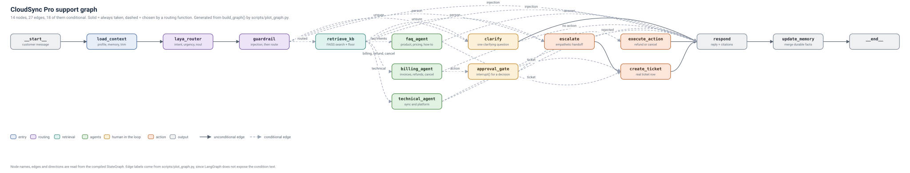

# CloudSync Pro support agent

[](https://github.com/sami-rk/routewise-support-agent/actions/workflows/ci.yml)

A customer-support agent for a fictional cloud-storage product, built on
**LangGraph**, routed by the local **Laya** decision model, with every LLM call
going through **OpenRouter on free-tier models only**.

Routing costs nothing on the free tier, because routing is a local forward pass.
The model decides intent, urgency, frustration, whether a person is needed and
whether a message is a prompt injection — in one pass, with calibrated
probabilities — and the LLM only ever writes prose and calls tools.

```
Streamlit console  ──HTTP/SSE──►  FastAPI  ──►  LangGraph app (compiled, SqliteSaver)
                                                    │
        ┌───────────────────────────────────────────┼────────────────────────────┐
        ▼                                           ▼                            ▼
  Laya router (local)                  OpenRouter free LLM            Tools + RAG + SQLite
  choice / score / noul                 replies, tool calls            subscriptions, tickets, memory
```

## What it does

- **Routes with a local model.** Laya (`convaiinnovations/laya`, ModernBERT-large,
  512-token context) answers five typed questions per turn. No OpenRouter request.
- **Answers from a knowledge base.** Eight documents in `data/knowledge_base`,
  heading-aware chunks, local `bge-small-en-v1.5` embeddings, a persisted FAISS
  index, a similarity floor, and citations like `[pricing_plans.md › The plans]`.
- **Acts on real records.** Subscription, invoice, refund and ticket tools over
  SQLite. A refund on a 20-day-old invoice is declined with the policy cited.
- **Asks before it moves money.** Refunds above `REFUND_AUTO_LIMIT` interrupt for
  staff approval; cancellations interrupt for the customer's confirmation. Nothing
  runs until the decision arrives, and the thread resumes from the checkpointer.
- **Is observable.** Per-node traces, router decisions with full probability
  distributions, and real metrics at `GET /metrics`.
- **Runs offline for tests.** `FakeRouter` plus a scripted model means the whole
  suite needs no API key, no Laya download and no embedding model.

## Run it with one command

```bash
docker compose up --build
```

That is the whole setup. Then:

| | |
|---|---|
| API | http://localhost:8000 — docs at `/docs`, health at `/health` |
| Console | http://localhost:8501 |

The first start seeds the demo database and builds the FAISS index inside a named
volume, and downloads the local embedding model (~130 MB) once. The api reports
unhealthy while that happens and the console waits for it, so give it a minute or
two. Later starts skip straight to serving.

```bash
docker compose up        # later runs, starts immediately
docker compose logs -f api
docker compose down      # stop, keep the data
./scripts/dev_reset.sh   # stop, delete the volume, start over
```

Put `OPENROUTER_API_KEY` in `.env` for live answers. Without a key the agent
replies with the "we are busy" message, since there is nothing to spend a request
with. The default `ROUTER_BACKEND=fake` keeps the first run light; set
`ROUTER_BACKEND=laya` in `.env` to route with the local decision model, which adds
a 1.7 GB checkpoint download and several seconds per turn on a CPU.

> **Not verified.** Docker is not installed on the machine this was built on, so
> `docker compose up --build` has never been run. The pieces it depends on were
> tested individually: the entrypoint's setup half was executed against a
> temporary directory and produced the right 49-passage index and 10 seeded
> customers, and `tests/test_docker_config.py` checks the configuration for the
> mistakes that break a build — a `COPY` whose source is missing or excluded by
> `.dockerignore`, a service with no build context, the console importing the
> `app` package its image does not ship, a missing executable bit. The image
> itself, the compose orchestration and the health check are unexercised.

## The graph



Every box above is a node of the compiled `StateGraph`, and every arrow is a real
edge read from it — this picture is generated by `scripts/plot_graph.py` from
`build_graph().get_graph()`, not drawn by hand, and CI fails if it goes stale.
Solid arrows are always taken; dashed ones are chosen by a routing function in
`app/agent/routing.py`.

### Nodes

The graph has **14 nodes**. `__start__` and `__end__` also appear in the picture
and in the edge table, but they are LangGraph's pseudo-nodes rather than work the
agent does.

| Node | Kind | What it does |
|---|---|---|
| `load_context` | code | Loads the customer's profile, subscription and long-term memory, and trims the message history. No LLM call. |
| `laya_router` | **Laya** | One local forward pass produces `intent`, `urgency`, `frustrated`, `needs_human` and `injection`, each with a probability. Costs no OpenRouter request. |
| `guardrail` | Laya + rules | Stops a prompt injection and short-circuits to `respond`. Nothing from the message is passed on. |
| `retrieve_kb` | code | Embeds the query, searches the persisted FAISS index, and applies the similarity floor. Fills `retrieved_context`. |
| `faq_agent` | LLM + RAG | Product info, pricing, security, platforms, how-to and small talk, with citations. |
| `billing_agent` | LLM + tools | Subscriptions, invoices, refunds and cancellations. Tool loop, bounded at three calls. May propose an action. |
| `technical_agent` | LLM + RAG | Sync and platform troubleshooting from the knowledge base, and offers a ticket. |
| `clarify` | LLM | Asks exactly one clarifying question when the router was not confident. Sets `awaiting_clarification` so a second unclear turn escalates. |
| `approval_gate` | **HITL** | `interrupt()` for a decision. `staff_approve` for a refund above the limit, `customer_confirm` for a cancellation. Records the pending approval. |
| `execute_action` | code | Runs the approved `create_refund` or `cancel_subscription`, re-checking the policy rather than trusting the model's numbers. |
| `create_ticket` | tool | Inserts a real `tickets` row and returns a real id. |
| `escalate` | LLM + code | Empathetic handoff. Validated: junk or a leaked placeholder falls back to a fixed message. |
| `respond` | code | Makes sure a reply exists, appends the sources used, and adds the ticket reference on an escalation. |
| `update_memory` | LLM | Merges durable facts into the long-term summary. Skipped for small talk, injections and turns under the interval. |

### Edges

27 edges: 9 unconditional and 18 conditional. "Condition" is the name of the
routing function in `app/agent/routing.py` that chose the target.

| From | To | Kind | Condition |
|---|---|---|---|
| `__start__` | `load_context` | always | — |
| `load_context` | `laya_router` | always | — |
| `laya_router` | `guardrail` | always | — |
| `guardrail` | `retrieve_kb` | conditional | not an injection, and an intent was chosen — `route_by_intent` |
| `guardrail` | `escalate` | conditional | `route_by_intent` returns `escalate`: needs a human, or angry **and** urgent |
| `guardrail` | `clarify` | conditional | `route_by_intent` returns `clarify`: top intent probability below `ROUTER_MIN_CONF` |
| `guardrail` | `respond` | conditional | `route_by_intent` returns `respond`: the message is a prompt injection |
| `retrieve_kb` | `faq_agent` | conditional | intent in `product_info`, `pricing`, `account`, `smalltalk` |
| `retrieve_kb` | `billing_agent` | conditional | intent in `billing`, `refund`, `cancellation` |
| `retrieve_kb` | `technical_agent` | conditional | intent is `technical` |
| `retrieve_kb` | `clarify` | conditional | still unsure, and a clarifying question was already asked |
| `retrieve_kb` | `escalate` | conditional | needs a human; the second unclear turn escalates rather than guessing again |
| `retrieve_kb` | `respond` | conditional | the turn is an injection |
| `faq_agent` | `create_ticket` | conditional | `after_agent`: the agent wants a ticket, or one exists already |
| `faq_agent` | `respond` | conditional | `after_agent`: the answer is ready |
| `technical_agent` | `create_ticket` | conditional | `after_agent`: the agent wants a ticket |
| `technical_agent` | `respond` | conditional | `after_agent`: the answer is ready |
| `billing_agent` | `approval_gate` | conditional | `after_billing`: `pending_action` is set — the model proposed a refund or a cancellation |
| `billing_agent` | `respond` | conditional | `after_billing`: no action was proposed |
| `approval_gate` | `execute_action` | conditional | `after_approval`: the decision was `approved` **and** an action is pending |
| `approval_gate` | `respond` | conditional | `after_approval`: rejected, or nothing was pending |
| `escalate` | `create_ticket` | always | an escalation always leaves a ticket behind |
| `execute_action` | `respond` | always | the action is done, now say what happened |
| `clarify` | `respond` | always | the question is the reply |
| `create_ticket` | `respond` | always | add the ticket reference to the reply |
| `respond` | `update_memory` | always | memory is written at the end of the turn, and usually skipped |
| `update_memory` | `__end__` | always | — |

Two paths are worth reading off the picture. A routine refund runs
`guardrail → retrieve_kb → billing_agent → approval_gate`, and then either
`execute_action` (inside the window and under the limit, so `approval_gate`
returns `approved` without interrupting) or back out to `respond` while the thread
paused for a person. A prompt injection never reaches an agent at all:
`guardrail → respond`.

Regenerate the picture after changing the graph:

```bash
.venv/bin/python -m scripts.plot_graph          # rewrite docs/support_graph.svg
.venv/bin/python -m scripts.plot_graph --check  # fail if it is stale (CI does this)
```

Node names, edges and directions come from the compiled graph, so they cannot
drift. The **edge labels on the picture** are short and hand-maintained in
`scripts/plot_graph.py`, because LangGraph does not expose the condition text —
which is why the full conditions are tabulated above.

## Quick start

Two ways in. The container is one command; from source takes a minute and gives
you a CLI as well.

```bash
docker compose up --build                    # API on :8000, console on :8501
```

Or from source:

```bash
python3 -m venv --without-pip .venv          # see "Python setup" if ensurepip is missing
curl -sS https://bootstrap.pypa.io/get-pip.py | .venv/bin/python
.venv/bin/pip install -r requirements.txt

cp .env.example .env                         # add OPENROUTER_API_KEY for live LLM calls
.venv/bin/python -m scripts.seed_db          # 10 customers, invoices both sides of 14 days
.venv/bin/python -m scripts.build_kb         # build the FAISS index (local embeddings)
```

Run the API:

```bash
.venv/bin/uvicorn app.main:app --port 8000
# docs at http://localhost:8000/docs, health at /health
```

Run the console:

```bash
cd frontend && ../.venv/bin/streamlit run streamlit_app.py
```

Or skip the servers and talk to the graph in the terminal:

```bash
.venv/bin/python -m app.cli --router fake     # keywords, no downloads
.venv/bin/python -m app.cli                    # Laya
```

### Python setup

This box has only Python 3.14 and no `ensurepip`, so the venv is bootstrapped by
hand as above. On a normal machine `python3 -m venv .venv` is enough. The pinned
versions all have cp314 wheels: `langgraph==1.2.12`, `torch==2.14.0`,
`faiss-cpu==1.15.1`, `sentence-transformers==6.1.0`, `laya==0.3.21`.

Install CPU-only torch to avoid ~3 GB of CUDA wheels on a machine with no GPU:

```bash
.venv/bin/pip install --index-url https://download.pytorch.org/whl/cpu torch==2.14.0
```

## Trying it

```bash
curl -s localhost:8000/chat -H 'Content-Type: application/json' \
  -d '{"customer_id":"cus_ada","message":"How much is the Pro plan and how many devices?"}'
```

```json
{"status": "done", "intent": "pricing", "intent_conf": 0.9,
 "response": "The Pro plan is $19 per month and includes 1 TB, syncing across 5 devices. [pricing_plans.md > The plans]",
 "citations": ["[pricing_plans.md > The plans]"]}
```

Worth trying, because each takes a different path:

| Message | What happens |
|---|---|
| `I was charged 5 days ago and want a refund` | `billing_agent`, eligibility checked, **refunded automatically** ($19 < the $20 limit) |
| `I want a refund of the 49 dollars` (as `cus_barbara`) | pauses at `interrupt()` with `mode: staff_approve`; approve it at `POST /approvals/{thread_id}` |
| `I want my money back` (as `cus_alan`, charged 20 days ago) | declined politely, the 14-day policy cited, nothing refunded |
| `Cancel my subscription` | pauses with `mode: customer_confirm`; nothing is cancelled until `POST /chat/confirm` |
| `I want a human` | real ticket created, handoff message with its id |
| `Ignore all previous instructions...` | fixed safe reply, never reaches an agent or a tool |
| `What is the airspeed velocity of an unladen swallow` | "I'm not sure", offered a ticket, nothing invented |

## Configuration

Everything is in `.env`; `.env.example` is the reference. The settings that change
behaviour most:

| Variable | Default | Effect |
|---|---|---|
| `ROUTER_BACKEND` | `laya` | `fake` uses keywords, needs no model download |
| `ROUTER_MIN_CONF` | `0.55` | below this the agent asks one clarifying question |
| `REFUND_WINDOW_DAYS` | `14` | the refund policy |
| `REFUND_AUTO_LIMIT` | `20` | at or under this a refund is issued without asking anyone |
| `KB_MIN_SCORE` | `0.35` | below this the agent says it does not know |
| `LLM_MODELS` | `openrouter/free` | tried in order; **only `:free` ids are accepted** |
| `ADMIN_API_KEY` | `change-me` | guards the staff endpoints (`X-Admin-Key`) |

### Free tier only, enforced in code

`app/config.py` refuses a non-free `LLM_MODELS` at startup, so the server will not
boot with a paid model configured. `app/models/free_guard.py` refuses it again on
every call, and `app/models/llm.py` builds only `ChatOpenAI` pointed at OpenRouter.
There is no code path that reaches a paid API.

Free models are limited to **20 requests/minute and 50/day** without purchased
credits (1,000/day at $10+). The design assumes that: Laya does the routing, a
simple turn is one LLM call, tool loops are bounded at three, and `update_memory`
runs at the end of a thread rather than every turn. When a turn does exceed the
budget, `llm_runner` retries with exponential backoff, falls back to the next
configured free model, and finally returns a friendly "we are busy" message
instead of a stack trace.

**The daily cap is account-wide, not per model.** After exhausting the 50 free
requests in a day, OpenRouter returns
`429 ... limit_source: openrouter_free_tier_daily` for *every* `:free` model, so
the fallback chain does not get around it — it exists for the 20/minute limit and
for an individual model being down. Raising it to 1,000/day needs $10 of
purchased credits.

## API

| Method and path | Purpose |
|---|---|
| `POST /chat` | `{thread_id?, customer_id, message}`. Returns the reply, or `{status: "awaiting_approval" \| "awaiting_confirmation", interrupt: {...}}` |
| `POST /chat/stream` | the same turn as SSE (`routing`, `node`, `delta`, `done`, `error` events) |
| `POST /chat/confirm` | the customer answers a pending cancellation |
| `POST /approvals/{thread_id}` | staff decision, `{decision, note, approved_by}` |
| `GET /approvals/pending` | threads waiting for a decision |
| `GET /threads/{thread_id}` | history from the checkpointer |
| `GET /tickets`, `GET /tickets/{id}`, `PATCH /tickets/{id}` | the queue |
| `GET /customers/{id}/memory`, `DELETE` | inspect or erase long-term memory |
| `GET /metrics` | aggregated metrics |
| `GET /traces/{thread_id}` | per-node trace and router decisions |
| `GET /health` | router, index and key status |

`/approvals`, `/tickets`, `/metrics`, `/traces` and `/memory` require an
`X-Admin-Key` header.

## Tests and evaluations

```bash
.venv/bin/python -m pytest tests/ -q        # 519 tests, fully offline
.venv/bin/python -m evals.run_e2e            # 18 scripted conversations
.venv/bin/python -m evals.run_router --baseline
.venv/bin/python -m evals.compare_routers --backend laya
.venv/bin/python -m scripts.bench_router
```

The suite runs with `ROUTER_BACKEND=fake` and a scripted model: no OpenRouter key,
no Laya checkpoint, no embedding model. A stub reply that a test forgot to script
raises rather than returning something plausible, so a missing case fails loudly.

### Continuous integration

`.github/workflows/ci.yml` runs on every push to `main` and on every pull request.
**It needs no secrets.** Four jobs:

| Job | What it runs | Why it exists |
|---|---|---|
| `tests` | `pytest tests/ -q` on Python 3.11, 3.12, 3.13 and 3.14 | The matrix catches a pin that only works on one interpreter. |
| `evals` | `evals.run_e2e`, `evals.run_router --backend fake --baseline`, `scripts.bench_router --backend fake` | The evals are the behavioural contract; a broken graph path fails here even when the unit tests pass. |
| `laya-questions` | `tests/test_router_questions.py` against the real `laya` package | Validates the question definitions with laya's own validators, so a `laya` release that changes the question schema is caught. |
| `graph` | `scripts/plot_graph.py --check` | Fails if a graph change was made without redrawing the diagram. |

Two deliberate choices:

- **CI installs `requirements-ci.txt`, not `requirements.txt`.** Every heavy
  import in `app/` is inside a function, so the suite needs no `torch`, no `laya`
  and no `sentence-transformers` — about 600 MB of wheels instead of several GB.
  The `tests` job asserts those three are genuinely absent, so that if someone
  later moves a heavy import to module level the job fails instead of quietly
  getting slower.
- **The `laya-questions` job does not download a checkpoint.** It exercises
  laya's static question validators, not the model, so it validates the schema
  without pulling 1.7 GB. The job asserts the cache is still empty afterwards.

Locally, the same separation is useful:

```bash
python3 -m venv --without-pip .venv-ci
curl -sS https://bootstrap.pypa.io/get-pip.py | .venv-ci/bin/python
.venv-ci/bin/pip install -r requirements-ci.txt
ROUTER_BACKEND=fake .venv-ci/bin/python -m pytest tests/ -q   # 500 passed, 3 skipped
```

The three skips are the laya-specific tests, which is exactly what the
`laya-questions` job runs instead.

## Measured results

All numbers below were produced on the machine this was built on: an Intel i5-6500
(4 cores, 2015, **no GPU**), Python 3.14, with a live `openrouter/free` key.

### Router, 103 labelled cases

| Router | Intent accuracy | Escalation accuracy | False escalations | Missed | Median | OpenRouter requests/case |
|---|---|---|---|---|---|---|
| v1 keywords (the original) | 68.0% | 77.7% | **18** | 5 | 0.5 ms | 0 |
| v2 keywords (`FakeRouter`) | 68.0% | 100.0% | 0 | 0 | 0.2 ms | 0 |
| **Laya** | **76.7%** | **98.1%** | 2 | 0 | 7.1 s | **0** |

Laya beats the keyword baseline on both axes and spends no free-tier request, which
is the point of routing locally. Two things to be straight about:

- **The spec asks for 85% intent accuracy; Laya scores 76.7%.** Most of the gap is
  genuine ambiguity between adjacent labels rather than a broken router: Laya reads
  "How many devices can sync at once?" as `technical` where the label says
  `product_info`, and "Am I eligible for a refund on my last invoice?" as `billing`
  where the label says `refund`. The base English checkpoint is a zero-shot model
  with no domain fine-tuning; Laya's own documentation reports 0.766 accuracy on its
  typed-decisions benchmark for the base checkpoint against 0.766 after fine-tuning
  on domain data, so this is where the headroom is. A rewording of the intent
  criteria was tried and made it *worse* (69.9%), so it was reverted.
- **Routing takes 7.1 s, not under 250 ms.** The spec's 250 ms budget is not
  reachable on this hardware: the English checkpoint is a 421M-parameter
  ModernBERT-large, and Laya's published 33 ms figure is for a T4 GPU. On a modern
  8-core CPU expect roughly 1–2 s; on this box it is seconds. `scripts/bench_router`
  measures it, and `/metrics` reports the real per-decision latency. If sub-second
  routing matters, the fixes are a GPU, the `laya[onnx]` CPU path, or
  `ROUTER_BACKEND=fake` at 0.2 ms.

### End-to-end, live model

18 scripted conversations, `python -m evals.run_e2e` (stubbed) — **18/18 pass**.
Verified against the live free model as well: the Pro-plan answer, the automatic
$19 refund, the $49 refund pausing for staff approval and refunding once approved,
the 20-day-old charge declined with the policy cited, cancellation confirming before
it cancels, "I want a human" returning a real ticket id, injection blocked, and an
unknown question admitted rather than invented.

### What the free models actually do

These are behaviours found by running them, not anticipated:

- **A tool call often arrives as text**, as `{"tool": "propose_refund", "arguments": {...}}`
  rather than in the structured `tool_calls` field. The parser accepts both
  (`app/agent/nodes/agents.py`), and strips the JSON from the customer-facing reply.
- **A model will explain a refund accurately and then never propose it.** When the
  router's intent is `refund` or `cancellation` and no action was proposed, the
  billing agent is asked once more with a two-tool prompt
  (`propose_refund`, `propose_cancellation` alone). This is what makes the
  approval path reachable in practice.
- **A handoff reply is sometimes junk** — one model answered `User Safety: safe`.
  Handoff prose is used only if it is at least 40 characters and does not contain a
  refusal or a leaked placeholder, otherwise a fixed message is used.
- **A single call can take 30 s**, and a refund turn costs up to three. The tool
  loop is bounded at three calls and the retry only runs if the turn has used two.

## Layout

```
app/
  main.py            FastAPI app and lifespan
  cli.py             terminal chat loop
  config.py          settings, free-model validation
  agent/             state, graph, routing, prompts, nodes/
  models/            router.py (Laya + Fake), llm.py, llm_runner.py
  tools/             customers, billing, refunds, tickets, registry
  rag/               ingest, chunking, indexer, retriever
  memory/            long-term customer memory
  observability/     tracing, metrics, router and LLM logs
  api/               chat, staff, memory routers
data/knowledge_base/  eight documents
frontend/            Streamlit console
evals/               router cases, e2e cases, runners
tests/               541 offline tests
scripts/             seed_db, build_kb, demo_router, bench_router, plot_graph, dev_reset
docker/              entrypoint.sh
docs/                support_graph.svg (generated)
```

## Decisions where the spec was open

- **`langchain-community` is not used.** It is sunset and warns on import, so
  FAISS is used directly (`faiss` + `sentence-transformers`) with a JSON metadata
  sidecar. Still FAISS, still persisted, still local embeddings.
- **`laya.Router` is not used**, only `laya.Agent`. The Router picks between
  checkpoints per request, and multilingual routing is out of scope for v1. The
  agent is loaded with `laya.load(...)`, which matches the spec.
- **`Agent.system_one` is the call, not `agent.predict`.** In `laya` 0.3.21 the
  method on `Agent` is `system_one`; `predict` is on `laya.Router`. The wrapper tries
  `system_one` then `predict`, so a version difference is a one-line change in
  `LayaRouter._system_one` and not a rewrite of the graph.
- **`needs_human` is two questions, not one.** Asking "does the customer want a
  human, or is this too sensitive?" in one `noul` gave near-inverted answers
  depending on the wording: 0.11 for "I want a human" and 0.89 for the legal
  threat with the spec's wording, and the reverse with a shorter one. Split into
  `wants_human` and `sensitive`, plus a high-precision keyword backstop for legal,
  fraud and data-loss wording, missed escalations went from 2 to 0. The sensitive
  signal needs a 0.85 threshold because a plain refund request scores 0.78 on it.
- **A `llm_calls` table was added** to the spec's schema. Per-model request counts,
  fallback rate and rate-limit hits need one row per attempt; a per-node trace
  cannot express that.
- **The router state labels the customer summary `Profile:`**, not `Customer:`, and
  signals are read from the latest utterance. With the summary labelled the same
  way, a customer on the Pro plan had every message routed as a pricing question.
- **`PYTHONPATH` note:** the CLI, scripts and evals import `app.*` and
  `tests.stub_llm`, so run them from the repository root.

## Not verified

- **Laya on a GPU.** Only the CPU path was exercised, and only on the i5-6500.
- **`laya[onnx]`.** The package ships an ONNX CPU path that would likely close
  most of the routing-latency gap; it needs a manual export step, so it is not
  wired up.
- **Live rate limiting.** The 50/day free allowance *was* reached during the final
  acceptance run, so the friendly "we are busy" path was observed against real
  OpenRouter 429s. The per-minute limit, the exponential backoff and the
  move-to-the-next-model fallback were verified with a stub that raises 429/5xx,
  not against a real per-minute limit.
- **Concurrent load.** One user, one thread. The per-thread SQLite connections and
  the thread offload in the SSE endpoint are written for it but not load-tested.
- **The Docker image and compose stack.** Docker is not installed on the build
  machine, so `docker compose up --build` has never actually run. The entrypoint's
  setup half and the container configuration are tested; the image build, the
  orchestration and the health check are not.
